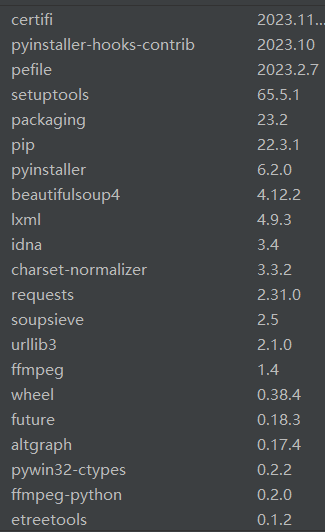

# **Python_Homework**
这是Mr.Jia的Python课程的大作业，放在这里保存一下以及供各位查看，感谢各位批评指正。

本作业使用Python3编写，请自行安装相关库。

我装了这么多

本作业分别为[电影管理系统](MovieManagementSystem.py)和[B站视频下载](BilibiliVideo.py)，有兴趣的可以fork一份自己研究下。

电影管理系统包含如下模块：（直接放图）

B站视频下载请自行研究。